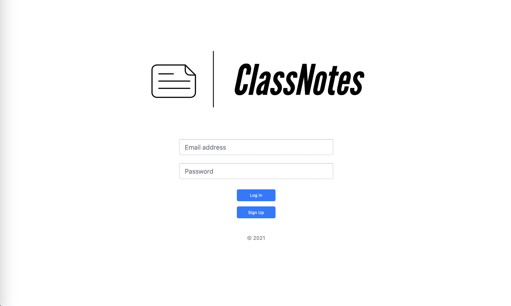
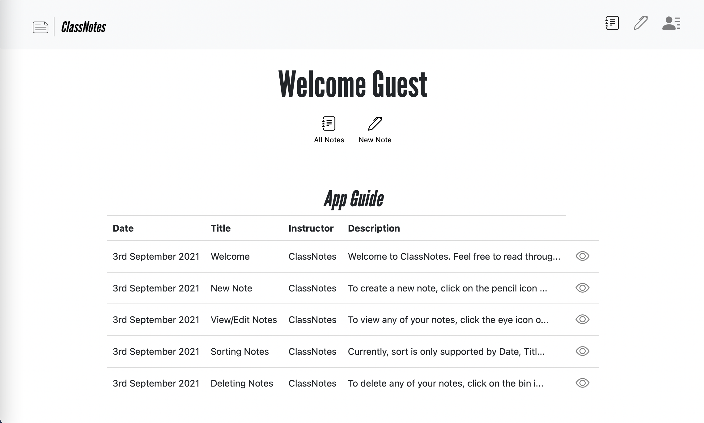
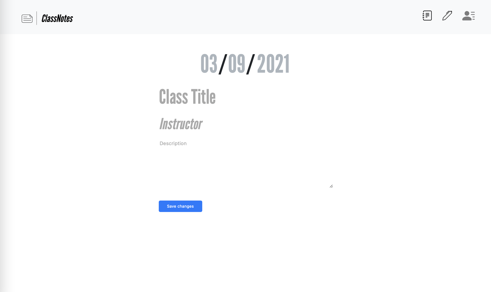
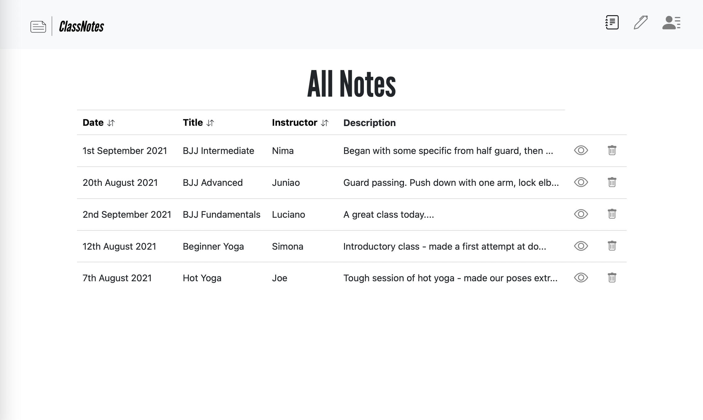

## Overview
A simple, lightweight journal to accompany learning a sport such as Yoga or Jiu Jitsu.
## Built with
* [Bootstrap](https://getbootstrap.com) - framework for building responsive sites with extensive components.
* [Animate.css](https://animate.style) - a library of ready-to-use, cross-browser animations for your web projects.
* [Ruby on Rails](https://rubyonrails.org) - server-side web app framework written in Ruby. 
* Key gems:  
  :gem: [devise](https://github.com/heartcombo/devise): authentication gem for Rails.  
  :gem: [pg](https://github.com/ged/ruby-pg): PostgreSQL gem for Rails.  
  :gem: [acts-as-taggable-on](https://github.com/mbleigh/acts-as-taggable-on): gem for tagging models in Rails.
  :gem: [awesome_print](https://github.com/awesome-print/awesome_print): very helpful when working with the rails console.  
* [Heroku](https://www.heroku.com) - service which allows developers to deploy applications.

## Usage
##### Clone the repo
```git clone https://github.com/arthurfincham/loginapp.git```

##### RVM
``` bash
% cd loginapp
% rvm install 2.7.3
% rvm use 2.7.3
```
##### Install gems
``` bash
% bundle install
% bundle exec rails server
```
##### Please note:
The current release is built with [PostgreSQL](https://postgresapp.com) for compatibility with [Heroku](https://www.heroku.com). If you are unfamiliar with Postgres, [SQLite3](https://www.sqlite.org/index.html) is a great alternative. In the **Gemfile**, change the following line:
``` ruby
gem 'pg'
```
to
``` ruby
gem 'sqlite3'
```
and then run
``` bash
bundle install
```

## Site
##### User Authentication

---
##### Welcome and Instructions

---
##### Write Note

---
##### All Notes



